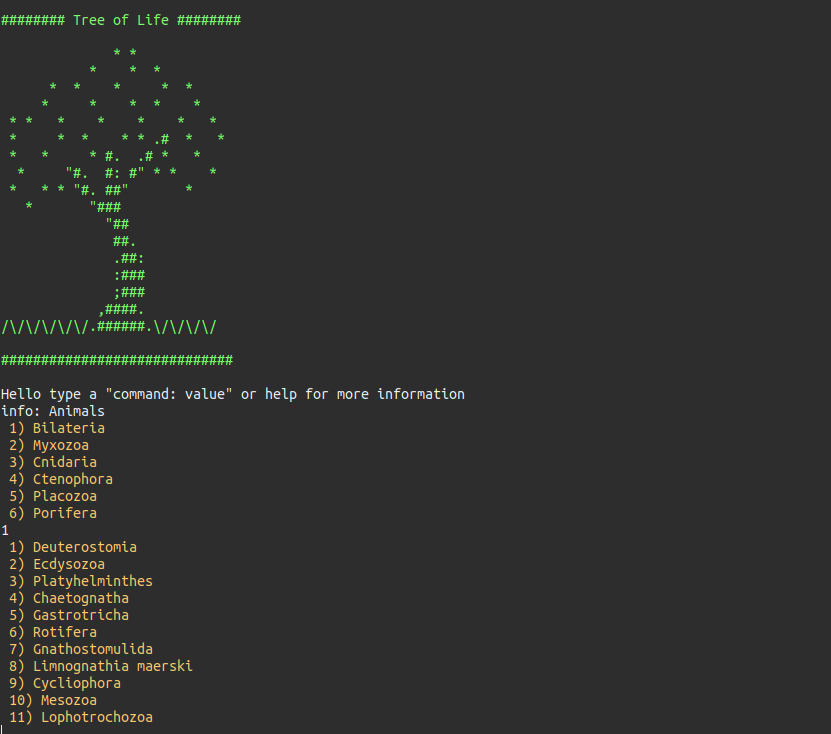
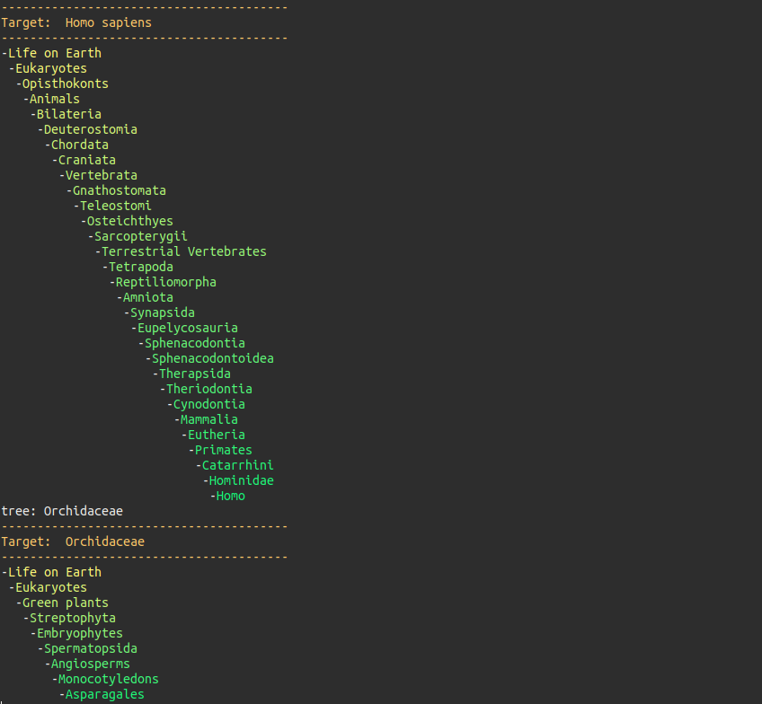
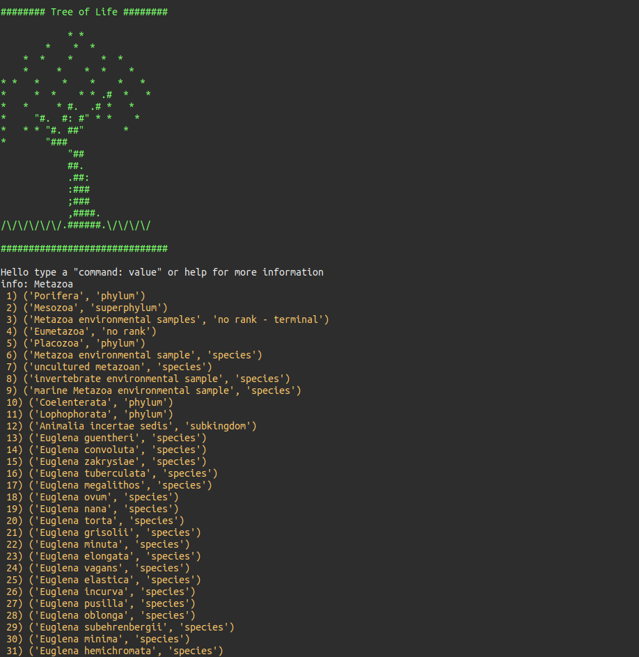
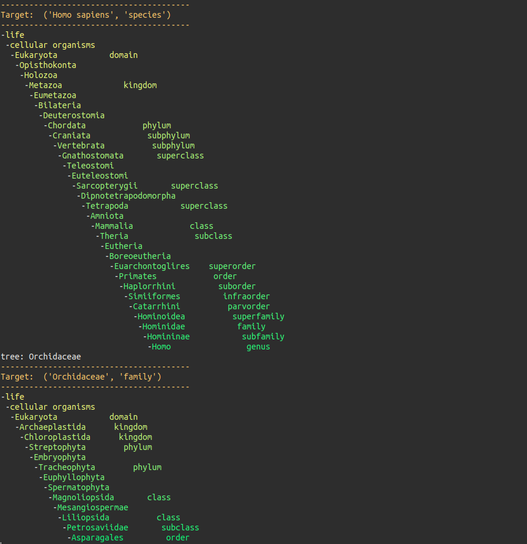

# Tree of Life

Using the Tree of life database [tol] (http://tolweb.org/tree/) or the much larger Open Tree of life databse [ott] (https://tree.opentreeoflife.org/) this short python code helps to visualize and look up different species from the terminal as well as explore the database by selecting different groups.

```
python species.py
```

<p align="center">
  
  
</p>

To use the larger database 4.5 million species (takes 5 seconds to load in memory) first create a directory called `ott` then download the `taxonomy.tsv` from the database and put it inside the folder. Then it can be used as follows

```
python species.py --database ott
```

<p align="center">
  
  
</p>